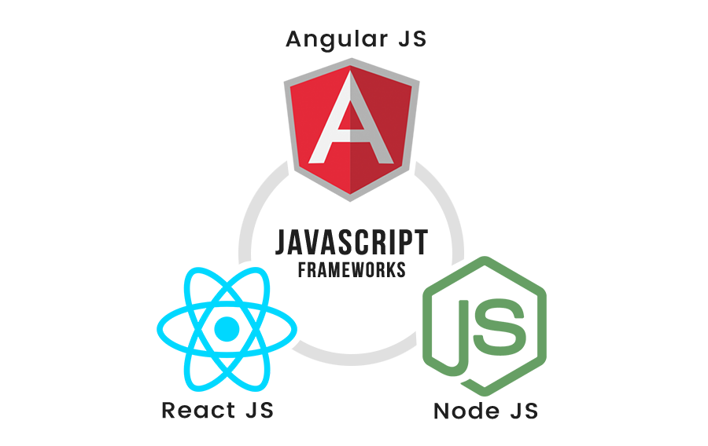

# Getting Started with JavaScript Questions

<head>
  <title>Getting Started with JavaScript Interview Questions & Answers</title>
  <meta charSet="utf-8" />
</head>

## Let's get started with the Basic JavaScript Questions

JavaScript is used today by companies such as Google, Amazon, Netflix, Microsoft, LinkedIn, and Facebook to build complex, desktop-like web applications. Since Node.js was introduced, it has also become one of the most popular languages for building server-side software. In today's world, even the web cannot contain JavaScript's versatility.

Every front-end interview starts with a question about JavaScript. These are the interviews that lead to the technical interview. In order to get into the technical interview, you must have knowledge of JavaScript and be able to verbally/orally describe its concepts, syntax, and data types. In this guide, we will cover the basics of the JavaScript phone/zoom interview as it pertains to questions and answers. We'll also cover advanced concepts that you should know and show you how to answer them confidently.

### Phone Interview #1

A software engineer interview usually begins with a brief phone conversation with a recruiter. Your recruiter may ask about your interest in the role and discuss the basic requirements with you. The recruiter then helps you schedule the next interview with the company, which is usually another phone screen with the hiring manager and team frontend engineer.

### Phone Interview #2

In this part of the interview process, you will be asked more specific questions. The hiring manager may ask you some introductory questions, but the front-end engineer will be the one conducting the interview. The interviewer will ask you questions about frontend frameworks and technologies you are familiar with, and then you'll be asked a series of JavaScript questions. This is where most software engineers fail to answer some of the most basic JavaScript questions.

### Our Goal

Our goal is to help you answer the most basic JavaScript questions by providing you with both the questions and the answers. We'll also provide you with a series of JavaScript questions that you can use to test your knowledge.

  <button class="getstarted"><a href="/docs/general-javascript-questions/javascript-basics/basic-javascript-questions-answers">Let's Get Started</a></button>

